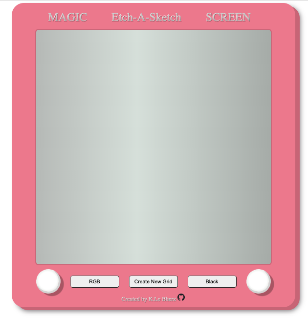

# etch-a-sketch
## The Odin Project // Etch A Sketch app
---

**Goals:** 
Create Etch-A-Sketch app which takes user input to determine size of the screen. 

    - Use Javascript to dynamically create the divs
    - Use CSS Grid to lay out
    - Add event listeners to change colour of pen
    - Create & modify README with markdown

---
**Positives:**
I am very happy with the way the CSS came together. I love the look and the small details like the gradient on the screen and the box-shadows. 

**Challenges:**
I was having an issue where the screen wouldnt clear before a new prompt came up. I worked around this by adding an if statement to the button to change the value from "clear" to "create grid" when pressed. This separated the two steps and enabled the screen to be cleared before the prompt was displayed. 

**To Look Into:**
1. I would love to delve into SVGs and get the knobs looking a bit more realistic. 
2. Also would like to look into the forEach method for iterating through NodeLists. 
3. I would like to split up the code within the controls eventlistener function to smaller functions. 
4. Adding better styling to the buttons to be more 3D, have styling on hover and active, and in the style of the 'case' of the etch-a-sketch. 
